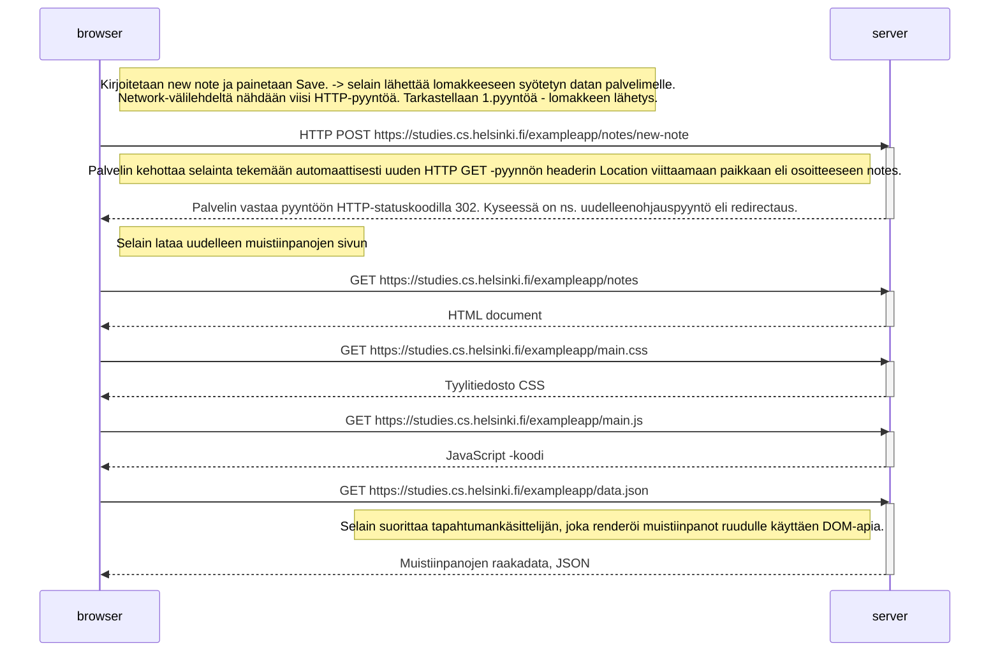

```mermaid

sequenceDiagram
    participant browser
    participant server

    
    note right of browser: Kirjoitetaan new note ja painetaan Save. -> selain lähettää lomakkeeseen syötetyn datan palvelimelle.<br>Network-välilehdeltä nähdään        viisi HTTP-pyyntöä. Tarkastellaan 1.pyyntöä - lomakkeen lähetys.
    browser->>server: HTTP POST https://studies.cs.helsinki.fi/exampleapp/notes/new-note
    activate server

    note left of server: Palvelin kehottaa selainta tekemään automaattisesti uuden HTTP GET ‑pyynnön headerin Location viittaamaan paikkaan eli osoitteeseen            notes.
    server-->>browser:  Palvelin vastaa pyyntöön HTTP-statuskoodilla 302. Kyseessä on ns. uudelleenohjauspyyntö eli redirectaus.
    deactivate server
    
    note right of browser: Selain lataa uudelleen muistiinpanojen sivun
    browser->>server: GET https://studies.cs.helsinki.fi/exampleapp/notes
    activate server

    server-->>browser: HTML document
    deactivate server

    browser->>server: GET https://studies.cs.helsinki.fi/exampleapp/main.css
    activate server

    server-->>browser: Tyylitiedosto CSS
    deactivate server

    browser->>server: GET https://studies.cs.helsinki.fi/exampleapp/main.js
    activate server

    server-->>browser: JavaScript -koodi
    deactivate server

    browser->>server: GET https://studies.cs.helsinki.fi/exampleapp/data.json
    activate server

    note left of server:  Selain suorittaa tapahtumankäsittelijän, joka renderöi muistiinpanot ruudulle käyttäen DOM-apia.
    server-->>browser: Muistiinpanojen raakadata, JSON
    deactivate server

    
```
