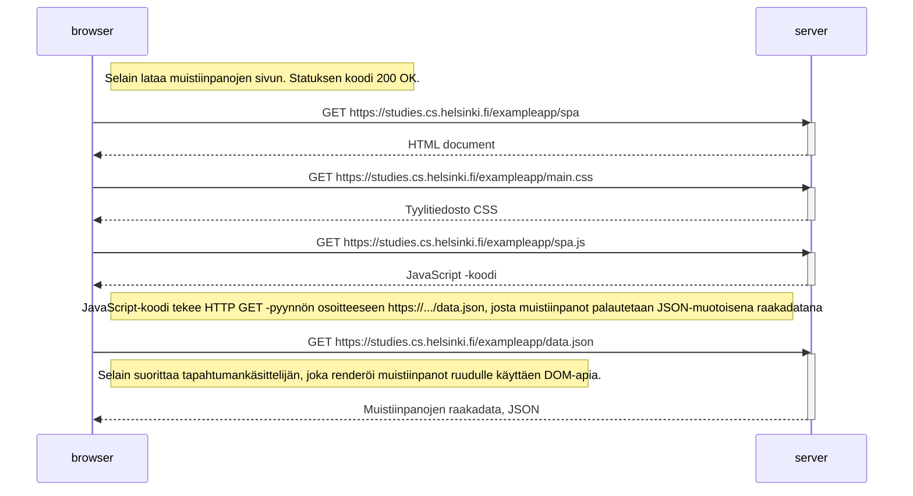

```mermaid

sequenceDiagram
    participant browser
    participant server

    
    note right of browser: Selain lataa muistiinpanojen sivun. Statuksen koodi 200 OK.
    browser->>server: GET https://studies.cs.helsinki.fi/exampleapp/spa
    activate server

    server-->>browser: HTML document
    deactivate server

    browser->>server: GET https://studies.cs.helsinki.fi/exampleapp/main.css
    activate server

    server-->>browser: Tyylitiedosto CSS
    deactivate server

    browser->>server: GET https://studies.cs.helsinki.fi/exampleapp/spa.js
    activate server

    server-->>browser: JavaScript -koodi
    deactivate server
    note right of browser: JavaScript-koodi tekee HTTP GET ‑pyynnön osoitteeseen https://.../data.json, josta muistiinpanot palautetaan JSON-muotoisena raakadatana
    browser->>server: GET https://studies.cs.helsinki.fi/exampleapp/data.json
    activate server

    note right of browser:  Selain suorittaa tapahtumankäsittelijän, joka renderöi muistiinpanot ruudulle käyttäen DOM-apia.
    server-->>browser: Muistiinpanojen raakadata, JSON
    deactivate server

```
