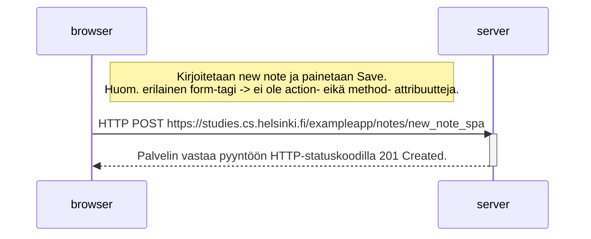

```mermaid

sequenceDiagram
    participant browser
    participant server

    
    note right of browser: Kirjoitetaan new note ja painetaan Save.<br>Huom. erilainen form-tagi -> ei ole action- eikä method- attribuutteja.
    browser->>server: HTTP POST https://studies.cs.helsinki.fi/exampleapp/notes/new_note_spa
    activate server

    server-->>browser:  Palvelin vastaa pyyntöön HTTP-statuskoodilla 201 Created. 
    deactivate server
    
```
